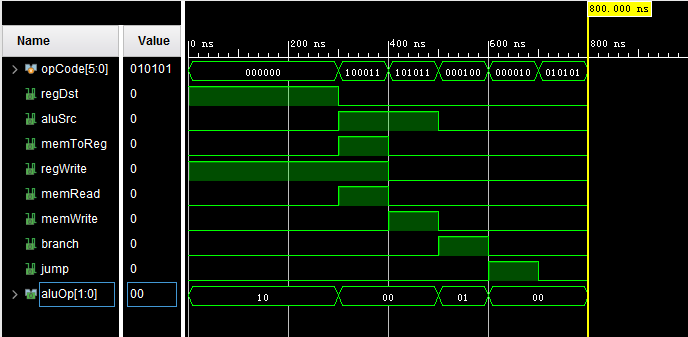
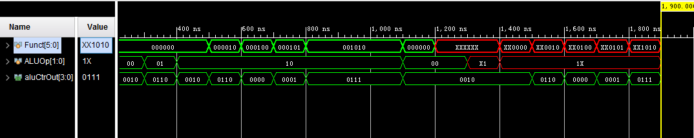
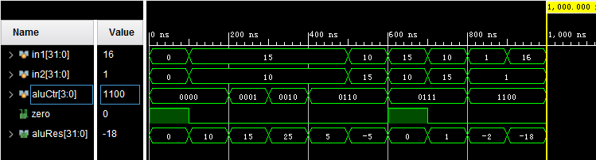

# 计算机系统结构实验报告 实验三

王梓涵 517021911179


## 概述

### 实验名称

简单的类 MIPS 单周期处理器部件实现——控制器，ALU

### 实验目的

* 理解 CPU 控制、ALU 的原理
* 实现主控制器、ALU 控制器和 ALU
* 使用功能仿真


## 主控制模块

### 模块描述

主控制单元为一个译码器，其接受指令的 [31:26] 位字段（opCode）作为输入，给 ALU 控制器、数据内存、寄存器和数据选择器输出正确的控制信号。

### 模块实现

在 Verilog 中，译码器可以使用 case 语句来实现。这里将 `opCode` 的各种可能作为若干 case，在每个 case 的代码块内按照指导书中所列的表格将输出的控制信号正确填写即可。

 ```verilog
module Ctr(
    input [5:0] opCode,
    output regDst,
    output aluSrc,
    output memToReg,
    output regWrite,
    output memRead,
    output memWrite,
    output branch,
    output [1:0] aluOp,
    output jump
);

    reg regDst;
    reg aluSrc;
    reg memToReg;
    reg regWrite;
    reg memRead;
    reg memWrite;
    reg branch;
    reg [1:0] aluOp;
    reg jump;

    always @(opCode)
        begin
            case(opCode)
                6'b000000: // R-type
                    begin
                        regDst = 1;
                        aluSrc = 0;
                        memToReg = 0;
                        regWrite = 1;
                        memRead = 0;
                        memWrite = 0;
                        branch = 0;
                        aluOp = 2'b10;
                        jump = 0;
                    end

                6'b100011: // lw
                    begin
                        regDst = 0;
                        aluSrc = 1;
                        memToReg = 1;
                        regWrite = 1;
                        memRead = 1;
                        memWrite = 0;
                        branch = 0;
                        aluOp = 2'b00;
                        jump = 0;
                    end

                6'b101011: // sw
                    begin
                        regDst = 0;
                        aluSrc = 1;
                        memToReg = 0;
                        regWrite = 0;
                        memRead = 0;
                        memWrite = 1;
                        branch = 0;
                        aluOp = 2'b00;
                        jump = 0;
                    end

                6'b000100: // beq
                    begin
                        regDst = 0;
                        aluSrc = 0;
                        memToReg = 0;
                        regWrite = 0;
                        memRead = 0;
                        memWrite = 0;
                        branch = 1;
                        aluOp = 2'b01;
                        jump = 0;
                    end

                6'b000010: // jmp
                    begin
                        regDst = 0;
                        aluSrc = 0;
                        memToReg = 0;
                        regWrite = 0;
                        memRead = 0;
                        memWrite = 0;
                        branch = 0;
                        aluOp = 2'b00;
                        jump = 1;
                    end

                default:
                    begin
                        regDst = 0;
                        aluSrc = 0;
                        memToReg = 0;
                        regWrite = 0;
                        memRead = 0;
                        memWrite = 0;
                        branch = 0;
                        aluOp = 2'b00;
                        jump = 0;
                    end

            endcase
        end

endmodule
 ```

### 仿真测试

仿真较为容易，只需要将 opCode 输入模块，观察其仿真波形是否符合预期即可。

```verilog
module Ctr_tb();

    reg [5:0] opCode;
    Ctr ctr(.opCode(opCode));

    initial begin
        opCode = 0;
        #100
        #100 opCode = 6'b000000;
        #100 opCode = 6'b100011;
        #100 opCode = 6'b101011;
        #100 opCode = 6'b000100;
        #100 opCode = 6'b000010;
        #100 opCode = 6'b010101;
        #100;
    end

endmodule
```

### 仿真波形



经观察，控制信号符合指导书的描述，该模块实现成功。


## ALU 控制单元模块

### 模块描述

ALU 控制单元模块（ALUCtr）根据主控制器的 ALUOp 判断指令类型，从而向 ALU 输出正确的运算控制信号。R 类型指令是根据指令的低 6 位（funct）来的判断的，ALUCtr 会综合 ALUOp 和 funct 来进行译码。

### 模块实现

和主控制模块 Ctr 类似，也是通过 case 语句来实现解码的。这里有一个注意点就是 `casex` 作为 case 语句的一种变体，是可以在 case 表达式中包含无关项的。对任意一个输入，是按照模块编写者指定的顺序，寻找第一个满足的 case 输出的。在编写程序的过程中，一定注意将所有 case 从高位开始，按照先写不含无关项的 case 再写含无关项的 case 的顺序排列，才不会出现意料之外的情况。

```verilog
module ALUCtr(
    output [3:0] aluCtrOut,
    input [5:0] Funct,
    input [1:0] ALUOp
);

    reg [3:0] aluCtrOut;

    always @({ALUOp, Funct})
        begin
            casex({ALUOp, Funct})
                8'b00xxxxxx: aluCtrOut = 4'b0010;
                8'b1xxx0000: aluCtrOut = 4'b0010;
                8'b1xxx0010: aluCtrOut = 4'b0110;
                8'b1xxx0100: aluCtrOut = 4'b0000;
                8'b1xxx0101: aluCtrOut = 4'b0001;
                8'b1xxx1010: aluCtrOut = 4'b0111;
                8'bx1xxxxxx: aluCtrOut = 4'b0110;
                default: aluCtrOut = 4'b0000;
            endcase
        end

endmodule
```

### 仿真测试

将 opCode 和 funct 一起输入模块，为了测试 `casex` 的编写是否正确，需要包含含有无关项的测试输入，以确保模块对于任意符合要求的输入都能输出正确的控制信号。

```verilog
module ALUCtr_tb();

    reg [5:0] Funct;
    reg [1:0] ALUOp;

    ALUCtr ctr(.Funct(Funct), .ALUOp(ALUOp));

    initial begin
        Funct = 0;
        ALUOp = 0;

        #100 // with definite case
        #100 Funct = 6'b000000; ALUOp = 2'b00;
        #100 ALUOp = 2'b01;
        #100 ALUOp = 2'b10;
        #100 Funct = 6'b000010;
        #100 Funct = 6'b000100;
        #100 Funct = 6'b000101;
        #100 Funct = 6'b001010;
        #100;

        #100 // with don't care case
        #100 Funct = 6'b000000; ALUOp = 2'b00;
        #100 Funct = 6'bxxxxxx;
        #100 ALUOp = 2'bx1;
        #100 Funct = 6'bxx0000; ALUOp = 2'b1x;
        #100 Funct = 6'bxx0010;
        #100 Funct = 6'bxx0100;
        #100 Funct = 6'bxx0101;
        #100 Funct = 6'bxx1010;
        #100;
    end

endmodule
```

### 仿真波形



经观察，控制信号符合指导书的描述，该模块实现成功。


## ALU 模块

### 模块描述

根据 ALUCtr 的控制信号，对两个操作数进行某个逻辑或算术运算，将结果输出到 ALURes 中。如果结果为零，将 Zero 设为真。

### 模块实现

根据 ALUCtr 信号，对操作数进行相应运算即可。Verilog 中的操作符和 C 语言类似，较为直观。注意结果运算完要根据 ALURes 是否为零来设置 Zero。

```verilog
module Alu(
    input [31:0] in1,
    input [31:0] in2,
    input [3:0] aluCtr,
    output zero,
    output [31:0] aluRes
);

    reg zero;
    reg [31:0] aluRes;

    always @ ({aluCtr, in1, in2})
        begin
            zero = 0;
            case (aluCtr)
                4'b0010: // add
                    begin
                        aluRes = in1 + in2;
                        if (aluRes == 0)
                            zero = 1;
                    end
                4'b0110: // sub
                    begin
                        aluRes = in1 - in2;
                        if (aluRes == 0)
                            zero = 1;
                    end
                4'b0000: // and
                    begin
                        aluRes = in1 & in2;
                        if (aluRes == 0)
                            zero = 1;
                    end
                4'b0001: // or
                    begin
                        aluRes = in1 | in2;
                        if (aluRes == 0)
                            zero = 1;
                    end
                4'b1100: // nor
                    begin
                        aluRes = ~(in1 | in2);
                        if (aluRes == 0)
                            zero = 1;
                    end
                4'b0111: // set on less than
                    begin
                        if (in1 < in2)
                            begin
                                aluRes = 1;
                                zero = 0;
                            end
                        else 
                            begin
                                aluRes = 0;
                                zero = 1;
                            end
                    end
            endcase
        end

endmodule
```

### 仿真代码

 输入两个操作数，改变操作码和操作数来检查模块的正确性。

```verilog
module Alu_tb();

    reg [31:0] in1;
    reg [31:0] in2;
    reg [3:0] aluCtr;

    Alu alu(.in1(in1), .in2(in2), .aluCtr(aluCtr));

    initial begin
        in1 = 0; in2 = 0; aluCtr = 4'b0000;
        #100 in1 = 15; in2 = 10; 
        #100 aluCtr = 4'b0001;
        #100 aluCtr = 4'b0010;
        #100 aluCtr = 4'b0110;
        #100 in1 = 10; in2 = 15;
        #100 aluCtr = 4'b0111; in1 = 15; in2 = 10;
        #100 in1 = 10; in2 = 15;
        #100 aluCtr = 4'b1100; in1 = 1; in2 = 1;
        #100 in1 = 16;
        #100;
    end

endmodule
```

### 仿真波形



经观察，运算结果正确，该模块实现成功。


## 总结与反思

### 重点与难点

本次实验中指导书提供的指导比前两次实验相对简略一些，要完成这些实验，需要对前两次的实验代码有所熟悉才才能比较顺利完成。

* 本次实验主要锻炼用硬件描述语言的思想来编写模块的能力，需要摆脱一些使用常见编程语言的惯性思维。硬件描述语言是声明式的语言，编程者指定的是硬件的逻辑结构；而常见的 C++、Python 等语言是命令式的，编程者指定的是解决问题的步骤。对所使用的语言有宏观的把握，有助于更好地编写硬件描述程序。

* 本次实验中我在 ALU 控制单元部分所花时间较长，主要是因为对 `casex` 的语意不清楚导致测试结果和样例不一样，最后认识到了其顺序求值的方式才能顺利开展。

