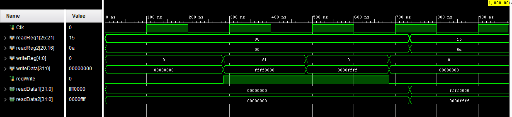
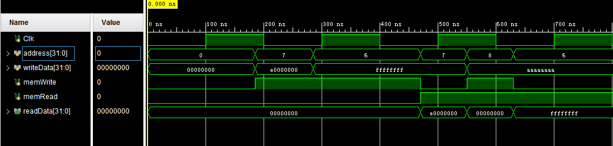
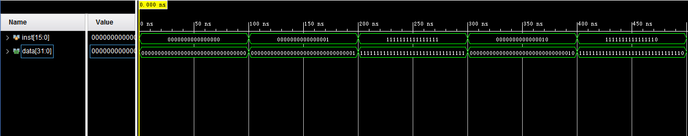

# 计算机系统结构实验报告 实验四

王梓涵 517021911179


## 概述

### 实验名称

简单的类 MIPS 单周期处理器部件实现——寄存器与存储器

### 实验目的

* 理解寄存器与存储器
* 实现寄存器、数据存储器和符号扩展
* 使用行为仿真


## 寄存器模块

### 模块描述

寄存器是有限存贮容量的高速存贮部件，它们可用来暂存指令、数据和地址，寄存器是指令操作的主要对象。MIPS 处理器中一共有 32 个 32 位通用寄存器。

### 模块实现

寄存器的读取是组合逻辑，写入是时序逻辑，所以只要遇到 readReg 信号就可以读取，但是必须要同步，不然会发生错误。指导书中要求是在下降沿进行写入操作。

```verilog
module Registers(
    input Clk,
    input [25:21] readReg1,
    input [20:16] readReg2,
    input [4:0] writeReg,
    input [31:0] writeData,
    input regWrite,
    output [31:0] readData1,
    output [31:0] readData2
);

    reg [31:0] readData1;
    reg [31:0] readData2;

    reg [31:0] regFile[31:0];
    always @ (readReg1 or readReg2 or writeReg)
        begin
            if (readReg1)
                readData1 = regFile[readReg1];
            else 
                readData1 = 0;
            if (readReg2)
                readData2 = regFile[readReg2];
            else 
                readData2 = 0;
        end

    always @ (negedge Clk)
        begin
            if (regWrite)
                regFile[writeReg] = writeData;
        end

endmodule
```

### 仿真测试

这里直接采用指导书中的激励信号，在若干时刻对寄存器进行读取或写入操作。

```verilog
module Registers_tb();

    reg Clk;
    reg [25:21] readReg1;
    reg [20:16] readReg2;
    reg [4:0] writeReg;
    reg [31:0] writeData;
    reg regWrite;

    Registers registers(.Clk(Clk),.readReg1(readReg1), .readReg2(readReg2), 
                        .writeReg(writeReg), .writeData(writeData), 
                        .regWrite(regWrite));
    always #100 Clk = !Clk;

    initial begin
        Clk = 0;
        readReg1 = 0;
        readReg2 = 0;
        regWrite = 0;
        writeReg = 0;
        writeData = 0;

        #285; // 285 ns
        regWrite = 1'b1;
        writeReg = 5'b10101;
        writeData = 32'b11111111111111110000000000000000;
        #200; // 485 ns
        writeReg = 5'b01010;
        writeData = 32'b0000000000000001111111111111111;
        #200 // 685 ns
        regWrite = 1'b0;
        writeReg = 5'b00000;
        writeData = 32'b000000000000000000000000000000;
        #50; // 735 ns
        readReg1 = 5'b10101;
        readReg2 = 5'b01010;
    end

endmodule
```

### 仿真波形



该波形完全符合预期，寄存器模块实现成功。


## 数据存储器模块

### 模块描述

该模块即体系结构中的随机访问存储器（RAM），可以随时读写任意有效地址的数据。

### 模块实现

数据存储器模块和寄存器模块类似，写数据也要考虑信号同步，实现代码和寄存器基本相同。

```verilog
module DataMemory(
    input Clk,
    input [31:0] address,
    input [31:0] writeData,
    input memWrite,
    input memRead,
    output [31:0] readData
);

    reg [31:0] memFile[0:63];
    reg [31:0] readData;

    always @ (address)
        begin
            if (memRead && !memWrite)
                readData = memFile[address];
            else
                readData = 0;
        end        

    always @ (negedge Clk)
        begin
            if (memWrite)
                memFile[address] = writeData;
        end

endmodule
```

### 仿真测试

这里直接采用了指导书中所给的代码，分别测试了在读取、写入内存的激励信号下存储器的行为。

```verilog
module DataMemory_tb();

    reg Clk;
    reg [31:0] address;
    reg [31:0] writeData;
    reg memWrite;
    reg memRead;

    DataMemory mem(.Clk(Clk), .address(address), .writeData(writeData), 	
                   .memWrite(memWrite), .memRead(memRead));
    always #100 Clk = !Clk;

    initial begin
        // Initialization
        Clk = 0;
        address = 0;
        writeData = 0;
        memWrite = 0;
        memRead = 0;

        #185; // 185 ns
        memWrite = 1'b1;
        address = 7;
        writeData = 32'he0000000;

        #100; // 285 ns
        address = 6;
        writeData = 32'hffffffff;

        #185; // 470 ns
        memRead = 1'b1;
        memWrite = 1'b0;
        address = 7;

        #80; // 550 ns
        memWrite = 1'b1;
        address = 8;
        writeData = 32'haaaaaaaa;

        #80; // 630 ns
        address = 6;
        memWrite = 1'b0;
        memRead = 1'b1;
    end
    
endmodule
```

### 仿真波形



分别观察不同激励信号下存储器的输出信号的内部状态，符合预期。

这里需要对 `memWrite` 和 `memRead` 均为高电平时输出的 `readData` 做出解释。由于内存的读取为组合逻辑，如果写入的地址之前没有数据，那么 `readData` 应为 `xxxxxxxx`。而我编写模块时由于受到指导书中仿真示例影响，以为此时应该输出全零的信号，所以在实现时额外加入了相应的逻辑。如果不做特别处理，那么在这种情况下应该输出 `xxxxxxxx`。


## 符号扩展模块

### 模块描述

该模块可以将 16 位有符号数扩展为 32 位有符号数。

### 模块实现

判断一个 16 位带符号数是否表示的是负数，只要看其最高位是否为 1。如果为 1，那么扩展后的高 16 位全为 1，否则全为 0。按照此逻辑编写模块即可。

```verilog
module Signext(
    input [15:0] inst,
    output [31:0] data
);

    assign data = (inst[15]) ? (inst | 32'hffff0000) : (inst | 32'h00000000);

endmodule

```

### 仿真测试

分别给模块输入正数、复数和零的补码。

```verilog
module Signext_tb();

    reg [15:0] inst;
    Signext sext(.inst(inst));

    initial begin
        inst = 0;
        #100 inst = 1;
        #100 inst = -1;
        #100 inst = 2;
        #100 inst = -2;
        #100;
    end

endmodule

```

### 仿真波形




## 总结与反思

### 重点与难点

* 实验三主要实现的是控制器和运算器，它们都是组合逻辑单元，而本次实验主要实现的是存储器，存储器的读取功能依然是组合逻辑，而写入功能则是时序逻辑。写入需要考虑时钟同步的问题，要在专门的块中处理。认识到各模块中组合逻辑和时序逻辑的区别，对于后续实现整体的处理器结构是有帮助的。

* 对于 `memWrite` 和 `memRead` 均为高电平时 `readData` 的输出问题，老师在检查我的仿真波形时提出了这一问题，引起了我对于存储器中组合逻辑和时序逻辑的思考。这里要感谢老师细心、耐心的指导。

* 对于符号扩展模块中输出数的表达，我本来打算判定一个数是否小于零的，但是始终不能成功。之后我了解到 Verilog 中将数据当作无符号数来处理的，所以不可能小于零，只能用取最高位的方法判断正负。

### 改进

* 对于存储器的写入逻辑，由于其在时钟信号的 always 块中，应该使用非阻塞赋值。这一点在实验五中有所提及，之后已改正。

* 对于符号扩展，如果使用位拼接符，还可以有更简便的表达方式：

  ```verilog
  assign data={{16{inst[15]}},inst[15:0]};
  ```

  这样直接将 16 位数的最高位复制到 32 位数的高 16 位，不需要之前实现中的条件表达式和或运算。
